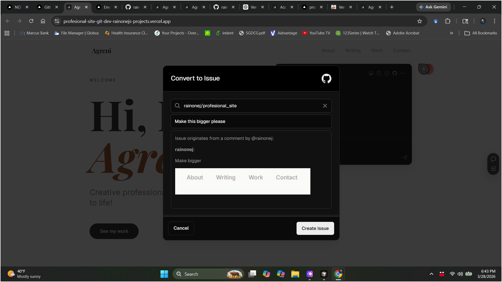

# Contributing

---

## Site Owner (Agreni)

### Your links

| | URL | Notes |
|---|---|---|
| **Live site** | <https://rainonej.github.io/profesional_site/> | Public — what the world sees |
| **Pages CMS** | <https://app.pagescms.org> | Edit content here — requires GitHub login |
| **Public preview** | <https://profesional-site.vercel.app> | Latest `dev` build — public, no login, **no comment toolbar** |
| **Review preview** | <https://profesional-site-git-dev-rainonejs-projects.vercel.app> | Same content — requires GitHub login, **has comment toolbar** |

> **Why two preview links?** Vercel's comment toolbar only works on "Preview" deployments, not on the public "Production" alias. Use the review preview link any time you want to leave feedback.

When you save something in Pages CMS it appears on the public preview within about 1 minute. The live site is updated by the developer when you're ready to publish a batch of changes.

---

### Using Pages CMS to edit your content

#### Step 1 — Sign in

1. Go to **<https://app.pagescms.org>**
2. Click **Sign in with GitHub** and authorize the app

   

3. You'll land on a project list — click **profesional_site**

   

4. The left sidebar shows your four content sections:
   - **Site Settings** — your name, bio, email, social links, Calendly URL
   - **Work / Projects** — portfolio entries
   - **Writing** — blog posts and essays
   - **Testimonials** — quotes from colleagues
   - **Media** — uploaded images

   > **Ignore the gear icon ("Settings").** That is a raw config file — not your content.

   

---

#### Step 2 — Edit your bio, tagline, and contact info

1. Click **Site Settings** in the sidebar
2. Edit any field:
   - **Name** — shown in the nav bar and homepage hero
   - **Tagline** — short line under your name on the homepage
   - **Bio** — your about-page text; line breaks are preserved
   - **Email** — shown on the About and Contact pages
   - **Booking URL** — your Calendly link (e.g. `https://calendly.com/yourname/30min`); leave empty to hide the booking widget
   - **Photo** — upload your headshot (see [Uploading images](#uploading-images))
   - **LinkedIn / Instagram** — full URLs shown as icon links
3. Click **Save** (top-right button)

   

---

#### Step 3 — Add or edit a work entry / project

1. Click **Work / Projects** in the sidebar
2. Click **Add an entry** (top right) — or click an existing entry to edit it

   

3. Fill in the fields:
   - **Title** — required
   - **Description** — one or two sentences shown in the work grid
   - **Image** — optional cover image
   - **Tags** — e.g. `Research`, `Curriculum`, `STEM`; press **Enter** after each tag
   - **External link** — link to a paper, report, or published project (optional)
   - **Date** — used for sorting (newest first)
   - **Show on homepage** — toggle on to feature this entry in the "Featured Work" section (max 3 shown at once)
   - **Details** — longer text shown when someone clicks into the entry; supports headings, bold/italic, and lists
4. Click **Save**

   

---

#### Step 4 — Write a blog post or essay

1. Click **Writing** in the sidebar
2. Click **Add an entry** for a new post — or click an existing one to edit
3. Fill in:
   - **Title** — required
   - **Description** — one sentence shown in the writing list and on the homepage
   - **Date** — publish date (used for ordering)
   - **Tags** — e.g. `Curriculum`, `Equity`, `Teaching`; press **Enter** after each
   - **Draft** — toggle on to hide the post from the public while you're writing; toggle off when ready to publish
   - **Post** — the full text; supports headings, bold/italic, lists, and links
4. Click **Save**

   > Posts marked **Draft** appear on the preview site but not the live site, so you can review them safely before publishing.

   

---

#### Step 5 — Add or edit a testimonial

1. Click **Testimonials** in the sidebar
2. Click **Add an entry** — or click an existing one
3. Fill in:
   - **Name** — the person's full name
   - **Role / Affiliation** — e.g. `Program Director, Girls Inc. NYC` (optional)
   - **Quote** — the testimonial text (no quotation marks — they are added automatically)
   - **Show on homepage** — toggle on to feature this quote on the homepage
4. Click **Save**

   

---

#### Uploading images

**Option A — from the Media section:**

1. Click **Media** in the sidebar
2. If you see "Media folder missing," click **Create folder**
3. Click **Upload** and choose a file from your computer

   

**Option B — directly inside an entry:**

1. Open any entry in Work / Projects or Site Settings
2. Click the **Image** field
3. A media picker opens — click **Upload** to add a file directly from there

   

---

#### What you can edit without a developer

- Name, tagline, bio, email, social links, Calendly booking URL
- Work/project entries — add, edit, delete, reorder by date
- Writing posts — draft, revise, publish
- Testimonials — add, edit, feature on homepage
- Images via the Media manager

#### What requires a developer

- Adding new page types or sections
- Changing layout, fonts, or colors
- Publishing a batch of changes from the preview site to the live site (intentional — you can draft freely without it going live immediately)

---

### Reviewing the preview site and leaving feedback

When you want to request a design change, flag a bug, or ask for anything to be different on the site, leave a comment on the review preview. Vercel lets you pin comments to exact spots on the page and convert them into GitHub issues that the developer (or automated AI agent) picks up.

> **Important:** The comment toolbar only appears on the **review preview** link, not on the public preview. Make sure you're at `profesional-site-git-dev-rainonejs-projects.vercel.app`.

#### One-time setup — GitHub Issues integration

The "Convert to Issue" button only appears after the Vercel GitHub Issues integration is installed and scoped to this project. **This is a one-time setup done by the developer** — if the GitHub icon is missing from comment threads, the integration is not yet installed.

**Developer: install it here:**

1. Go to [vercel.com/marketplace/gh-issues](https://vercel.com/marketplace/gh-issues)
2. Click **Add Integration**
3. Scope it to the **rainonej's projects** team and the **profesional-site** project
4. Authorize it to access the **rainonej/profesional_site** GitHub repo
5. Go back to the preview, refresh, open any comment thread — the GitHub icon should now appear in the top-right corner of the thread

Once installed, any team member (not just the developer) can convert comments to issues.

---

#### Step 1 — Sign in and open the review preview

1. Sign in to your GitHub account in the browser you'll use
2. Go to **<https://profesional-site-git-dev-rainonejs-projects.vercel.app>**
3. The Vercel toolbar appears at the **bottom of the page**

> If you don't see the toolbar, visit [vercel.com](https://vercel.com) first and sign in with GitHub, then return to the preview link.


---

#### Step 2 — Place a comment

1. Press **`C`** on your keyboard, or click the **comment bubble icon** in the toolbar — your cursor changes to a crosshair
2. Click anywhere on the page to pin a comment at that spot — or **click and drag** to select a region and attach a screenshot automatically
3. Type your feedback in the box that appears
4. Click **Comment** to post it


---

#### Step 3 — Convert to a GitHub Issue

1. After posting, the comment thread opens
2. In the **top-right corner of the thread**, click the **GitHub icon** (looks like the GitHub logo)
3. A dialog appears — confirm the repository (`rainonej/profesional_site`) and edit the title if needed
4. Click **Create Issue**



> **Note:** Converting a comment to an issue also **resolves the thread** in Vercel. This is permanent. Only convert when you're done discussing — Vercel recommends doing it once the feedback is final.

A confirmation appears at the bottom of the screen. Click it to see the new GitHub issue.

---

#### Step 4 — Done

The developer (or automated AI agent) will see the issue and implement the change. When it's done, the review preview updates automatically within ~1 minute of the fix being merged.

---

## Human Developer

### Prerequisites

- Node 22+
- npm
- [GitHub CLI (`gh`)](https://cli.github.com/) for PR operations
- Python 3 + yamllint (for the pre-commit YAML lint hook)

### Setup

```bash
pip install yamllint   # required for pre-commit hook
cd site
npm install            # also installs the husky pre-commit hook
```

This also installs the pre-commit hook (husky + lint-staged), which runs Prettier and ESLint on staged files before every commit. If hooks stop firing, re-run `npm install`.

### Development

```bash
cd site
npm run dev       # local dev server at http://localhost:4321
npm run build     # production build → site/dist/
```

### Linting

CI runs ESLint (Astro/JS/TS), stylelint (CSS), Prettier (formatting), and yamllint (`.pages.yml`, workflow files). Locally:

```bash
cd site
npm run lint      # check only
npm run lint:fix  # fix and format in-place
```

### Branch model

| Branch | Targets | Purpose |
|--------|---------|---------|
| `task/<N>-<slug>` | `epic/<N>-<slug>` (or `dev`) | Single task |
| `epic/<N>-<slug>` | `dev` | Group of related tasks |
| `dev` | `main` | Release PR |

- Branch names are enforced by `branch-name-check.yml` — non-conforming branches will fail CI
- Never force-push `dev` or `main`
- Issues are closed automatically when their branch merges (`close-task-on-merge.yml`)

### Commit format

[Conventional commits](https://www.conventionalcommits.org/): `feat:`, `fix:`, `chore:`, `docs:`, etc.

### Merging PRs

Always use auto-merge so the PR lands after CI passes:

```bash
gh pr merge <number> --auto --merge
```

Never use `--merge` alone — branch protection blocks merges until status checks pass.

### Vercel environments

Vercel has three environment tiers that behave differently:

| Environment | URL pattern | Toolbar / comments | Auth required |
|-------------|-------------|-------------------|---------------|
| **Production** | `profesional-site.vercel.app` | No | No (public) |
| **Preview** | `profesional-site-git-dev-rainonejs-projects.vercel.app` | Yes | Yes (GitHub/Vercel login) |
| **Development** | localhost | N/A | N/A |

**How the Vercel feedback workflow works:**

- The Production alias (`profesional-site.vercel.app`) reflects the latest `dev` push and is public, but has no comment toolbar.
- The branch Preview URL for `dev` is stable: `profesional-site-git-dev-rainonejs-projects.vercel.app` — this is what Agreni uses for reviewing and leaving comments.
- Vercel also creates a per-PR Preview deployment for every open PR (shown as a bot comment on the PR itself).
- When Agreni clicks the GitHub icon on a comment thread and hits "Create Issue", it lands in the repo's Issues tab ready to be triaged and labelled. **Converting resolves the thread permanently — it cannot be un-resolved.**

**Required one-time setup — GitHub Issues integration:**

The GitHub icon in comment threads only appears after installing the Vercel GitHub Issues integration. Without it, there is no "Convert to Issue" button.

1. Go to [vercel.com/marketplace/gh-issues](https://vercel.com/marketplace/gh-issues) and click **Add Integration**
2. Scope it to the **rainonej's projects** Vercel team and the **profesional-site** project
3. Authorize access to the **rainonej/profesional_site** GitHub repo
4. Refresh any preview deployment comment thread — the GitHub icon should now appear in the top-right corner

Only team members (Vercel accounts with access to the project) can convert comments to issues — this is not available to anonymous viewers.

**Vercel settings:**

- [Project environments](https://vercel.com/rainonejs-projects/profesional-site/settings/environments/preview) — configure Preview environment variables, protection, and branch targeting
- [Vercel environments docs](https://vercel.com/docs/deployments/environments#custom-environments) — official reference

### Reference docs

| Doc | What it covers |
|-----|---------------|
| [docs/ci.md](docs/ci.md) | CI jobs, triggers, branch protection setup |
| [docs/issue-labels.md](docs/issue-labels.md) | Label taxonomy: source, task-kind, owner, automation state |
| [docs/ai-workflows.md](docs/ai-workflows.md) | Lanes, planner policy, routing rules, unblocker behavior |
| [docs/project-management.md](docs/project-management.md) | Issue flow, board conventions, branch model |
| [docs/github-project-board.md](docs/github-project-board.md) | Board setup, Status field, views |
| [CLAUDE.md](CLAUDE.md) | AI autonomy config and hard limits |

---

## AI

This section is for AI agents (Claude Code, Copilot, and similar) working inside this
repository. The canonical autonomy config is in [CLAUDE.md](CLAUDE.md). What follows is
a structured summary of the workflow and expectations.

See also: [docs/ai-workflows.md](docs/ai-workflows.md) for the full operating model.

### Scope

All autonomous actions are sandboxed to `c:/Users/raino/GitHub/professional_site/`. Do not take actions outside this directory without explicit human approval.

### Allowed without confirmation

- Read, create, edit, or delete any file inside this repository
- Create and switch git branches
- Commit and push branches to `origin`
- Open PRs via `gh pr create`
- Merge PRs with `gh pr merge <number> --auto --merge`
- Install repo-local dependencies (`node_modules/`, etc.)
- Run build, lint, format, and test commands
- Create or modify `.github/workflows/` files
- Create `.env.local` files with placeholder values only

### Hard limits (always require human approval)

- Any action outside this repository
- `npm install -g` or any global package installs
- OS or system configuration changes
- Accessing or modifying secrets or credentials
- Force-pushing `main` or `dev`
- Using `gh pr merge` without `--auto` (branch protection enforces CI)

### Tech stack

| Layer | Tool |
|-------|------|
| Framework | Astro 6 (static-site generator) |
| Styling | Tailwind CSS |
| CMS | Pages CMS (git-backed; config in `.pages.yml`) |
| Production hosting | GitHub Pages (deploys from `main`) |
| Preview hosting | Vercel (tracks `dev`; public at `https://profesional-site.vercel.app`) |

### Branch and PR conventions

| Branch | Targets | Example |
|--------|---------|---------|
| `task/<N>-<slug>` | `epic/<N>-<slug>` (or `dev`) | `task/42-fix-hero-overflow` |
| `epic/<N>-<slug>` | `dev` | `epic/31-homepage-refresh` |
| `dev` | `main` | release PR |

- Branch names are enforced — non-conforming branches fail the `branch-name-check` CI job
- Issues close automatically when their branch merges (`close-task-on-merge.yml`)
- Always merge with: `gh pr merge <number> --auto --merge`

### Automated issue-to-PR workflow

```text
automation:plan label added → planner workflow runs → automation:planned applied
→ (blockers clear) → claude-ready added (or @claude comment) → Claude opens PR
→ PR merges into epic/* → issue closes automatically
```

| Trigger | What happens |
|---------|-------------|
| `automation:plan` label added | Planner workflow runs; shapes the issue |
| `claude-ready` label added | Claude workflow runs (approval gate) |
| `@claude <instruction>` comment | Claude workflow runs immediately |

**Label taxonomy:**

| Label | Meaning |
|-------|---------|
| `owner:simple-ai` | Copilot lane — fully specced, small task |
| `owner:agentic-ai` | Claude lane — multi-step, needs codebase reasoning |
| `owner:human-dev` | Human developer lane |
| `owner:site-owner` | Site owner (Agreni) lane |
| `task:feat` / `task:bug-fix` / `task:decision` / `task:content` | Kind of work |
| `source:human` / `source:vercel` / `source:cms` | Where the issue came from |
| `automation:plan` → `automation:planned` → `automation:started` | Automation state |
| `claude-ready` | Human approval gate (temporary; will be removed once system is trusted) |

### Pages CMS content flow

Agreni edits content in Pages CMS. Her changes commit directly to `dev` — no PR,
no issue, no CI. Vercel detects the push and rebuilds `profesional-site.vercel.app`
automatically. This is the correct behavior: content bypasses the task/epic/PR pipeline.

Do not create issues for CMS content changes unless Agreni explicitly asks for
developer help.

### CMS content model

Content lives under `site/src/content/`:

| Collection | Path | Format | Key fields |
|------------|------|--------|-----------|
| Site Settings | `settings/main.json` | JSON (singleton) | `name`, `tagline`, `bio`, `email`, `bookingUrl`, `photo`, `linkedin`, `instagram` |
| Work / Projects | `projects/` | Markdown + frontmatter | `title`, `description`, `image`, `tags`, `link`, `date`, `featured`, `body` |
| Writing | `writing/` | Markdown + frontmatter | `title`, `description`, `date`, `tags`, `draft`, `body` |
| Testimonials | `testimonials/` | JSON | `author`, `role`, `quote`, `featured` |

Media files are stored in `site/public/media/`.

### CI pipeline

CI runs on PRs targeting `dev` or `main`, and on pushes to `main`. Jobs in order:

1. `lint` — YAML lint, ESLint, stylelint, Prettier
2. `astro-check` — Astro type/diagnostic check
3. `build` — Astro production build
4. `deploy` — GitHub Pages deploy (only on `main`)

See [docs/ci.md](docs/ci.md) for details.

### Notes for agents

- Always check existing branches before starting: `git branch -a`
- `git pull --all` can error even when tracking is set — use `git pull`
- The `dev` branch is the integration branch; epic PRs target `dev`
- Do not attempt to build the `notesToDevTeam` CMS field — abandoned (issues #30, #38, #19 closed)
- The site owner (Agreni) is non-technical; `owner:site-owner` issues are blocked until she acts — never fabricate placeholder content for production fields
- `ANTHROPIC_API_KEY` must be set in GitHub repo secrets for `planner.yml` and `claude.yml` to work; adding secrets is a human task (#78)
